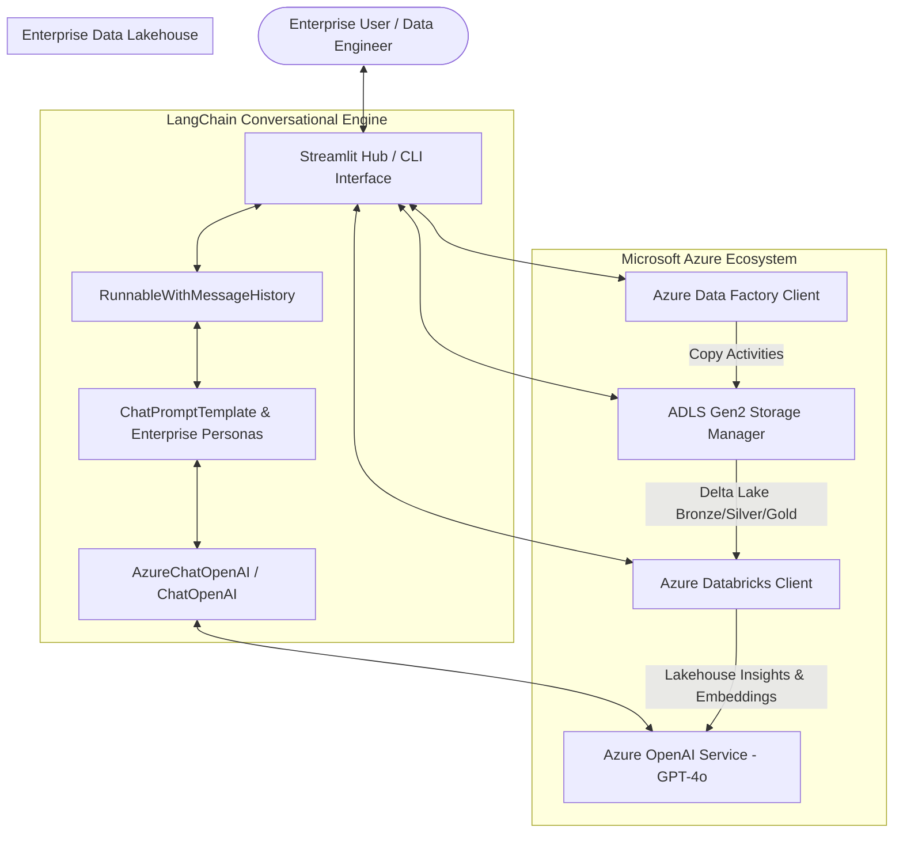

# 🔷 OpenAI LangChain AI Assistant (Azure OpenAI + ADF + Databricks)

An enterprise-grade conversational AI platform built with **Azure OpenAI Service (GPT-4o)**, **LangChain**, **Azure Data Factory (ADF)**, and **Azure Databricks**.

This project provides both an interactive **Streamlit Web Hub** and an interactive **Terminal CLI**, equipped with four specialized enterprise personas, live ADF pipeline telemetry, and Databricks cluster/job monitoring.

---

## 🏛️ Architecture Overview



---

## 🎭 Enterprise Personas

1. **🔷 Azure Cloud Solutions Architect (`azure_architect`)**:
   - Enterprise Landing Zones, CAF, Hub-Spoke VNets, NSGs, Private Endpoints.
   - Microsoft Entra ID (Azure AD) RBAC, Key Vault, and zero-trust security.
   - Cloud economics (Reserved Instances, Savings Plans, auto-shutdown).

2. **🏭 Azure Data Factory (ADF) Specialist (`adf_engineer`)**:
   - Resilient ELT pipeline design, Self-Hosted Integration Runtimes (SHIR).
   - Copy Activities, Data Integration Units (DIUs), and Mapping Data Flows.
   - Tumbling window triggers, event-driven pipelines, and Log Analytics alerts.

3. **⚡ Azure Databricks & Spark Engineer (`databricks_engineer`)**:
   - Distributed PySpark transformations, Delta Lake ACID transactions.
   - Liquid clustering, Z-Ordering, time travel, and file optimization (`OPTIMIZE`/`VACUUM`).
   - Unity Catalog metastore permissions, DBU management, and job clusters.

4. **📊 Azure Lakehouse & AI Strategist (`analytics_advisor`)**:
   - End-to-end Medallion architecture (Bronze ➔ Silver ➔ Gold ➔ GenAI).
   - Enterprise RAG and vector embedding integration patterns.
   - Executive TCO optimization, data mesh governance, and compliance.

---

## 📂 Project Structure

```
openai-langchain-ai-assistant/
├── .env.example                # Environment variables template
├── .gitignore                  # Git exclusions
├── requirements.txt            # Python dependencies (LangChain, Streamlit, Azure SDKs)
├── Dockerfile                  # Production container specification for Azure
├── README.md                   # Complete architectural and operational manual
├── config.py                   # Configuration dataclass with auto-loading
├── personas.py                 # Specialized enterprise persona definitions & prompts
├── chatbot.py                  # LangChain conversational engine (Azure OpenAI / OpenAI)
├── app.py                      # Multi-tab Streamlit Enterprise Web Hub (Port 8505)
├── cli.py                      # Interactive terminal assistant with slash commands
├── utils/
│   ├── __init__.py
│   ├── auth.py                 # Azure Managed Identity & OpenAI credential validator
│   ├── adf_client.py           # Azure Data Factory pipeline manager & telemetry
│   ├── databricks_client.py    # Azure Databricks workspace, clusters & jobs client
│   └── azure_storage.py        # ADLS Gen2 lakehouse container manager
└── tests/
    └── test_chatbot.py         # Unit tests for bot, personas, and platform clients
```

---

## 🚀 Quickstart

### 1. Set Up Virtual Environment & Dependencies

```bash
cd openai-langchain-ai-assistant
python3 -m venv .venv
source .venv/bin/activate
pip install -r requirements.txt
```

### 2. Configure Credentials (`.env`)

Copy `.env.example` to `.env` and provide your Azure OpenAI or OpenAI credentials:

```bash
cp .env.example .env
```

```ini
# Platform Selection ("azure" or "openai")
PLATFORM_MODE="azure"

# Azure OpenAI Service Credentials
AZURE_OPENAI_ENDPOINT="https://<your-resource-name>.openai.azure.com/"
AZURE_OPENAI_API_KEY="<your-azure-key>"
AZURE_OPENAI_API_VERSION="2024-06-01"
AZURE_OPENAI_CHAT_DEPLOYMENT="gpt-4o"

# Standard OpenAI API Key (Optional Alternative)
OPENAI_API_KEY=""
OPENAI_MODEL="gpt-4o"

# Azure Data Factory
AZURE_SUBSCRIPTION_ID="sub-prod-enterprise-001"
AZURE_RESOURCE_GROUP="rg-enterprise-data-prod"
ADF_FACTORY_NAME="adf-enterprise-analytics-prod"

# Azure Databricks
DATABRICKS_HOST="https://adb-enterprise-analytics.azuredatabricks.net"
DATABRICKS_CLUSTER_ID="dbw-cluster-prod-01"
```

> **Note**: If API keys are not yet configured, the application gracefully initializes in offline/diagnostic mode without crashing, allowing you to test ADF pipeline controls, Databricks cluster management, and enter keys via the UI.

---

### 3. Launch the Streamlit Web Hub

```bash
streamlit run app.py --server.port=8505
```

Navigate to **http://localhost:8505** in your browser.

#### Features in the Web Hub:
- **💬 Enterprise AI Assistant**: Multi-turn chat with streaming responses, role-specific question starters, and conversation export.
- **🏭 Azure Data Factory (ADF) Monitor**: Live pipeline execution history, activity run breakdown, and on-demand pipeline execution triggering.
- **⚡ Azure Databricks Workspace**: Real-time cluster inventory, worker node counts, DBU/hour burn rates, and one-click PySpark job triggering.
- **🏛️ Architecture & Best Practices**: Interactive architecture diagram and enterprise zero-trust security guide.

---

### 4. Interactive Terminal CLI

Run the CLI assistant directly in your terminal:

```bash
python cli.py --persona azure_architect --temperature 0.3
```

#### In-CLI Commands:
- `/personas` - View all available enterprise personas
- `/switch <id>` - Dynamically switch persona (e.g., `/switch databricks_engineer`)
- `/adf` - View live Azure Data Factory pipeline execution status
- `/databricks` - View Databricks cluster and job metrics
- `/clear` - Reset conversation memory
- `/exit` - Quit assistant

---

## 🧪 Running Unit Tests

Verify bot initialization, persona switching, ADF operations, and Databricks clients:

```bash
python -m unittest tests/test_chatbot.py
```

---

## 🐳 Docker & Azure Deployment

Build and run locally:

```bash
docker build -t openai-langchain-ai-assistant:latest .
docker run -p 8505:8505 --env-file .env openai-langchain-ai-assistant:latest
```

### Deploy to Azure Container Apps (ACA):

```bash
# 1. Login to Azure & ACR
az acr login --name <your-registry-name>

# 2. Tag and push image
docker tag openai-langchain-ai-assistant:latest <your-registry-name>.azurecr.io/openai-langchain-ai-assistant:v1
docker push <your-registry-name>.azurecr.io/openai-langchain-ai-assistant:v1

# 3. Create Container App
az containerapp create \
  --name openai-langchain-assistant-hub \
  --resource-group rg-enterprise-data-prod \
  --environment managed-env-prod \
  --image <your-registry-name>.azurecr.io/openai-langchain-ai-assistant:v1 \
  --target-port 8505 \
  --ingress external \
  --secrets azure-openai-key="<your-key>" \
  --env-vars AZURE_OPENAI_ENDPOINT="https://<your-resource>.openai.azure.com/" \
             AZURE_OPENAI_API_KEY=secretref:azure-openai-key \
             AZURE_OPENAI_CHAT_DEPLOYMENT="gpt-4o"
```

---

## 🔐 Enterprise Security Standards

- **Entra ID Managed Identity**: Eliminates hardcoded service keys for ADF and Databricks.
- **Azure Key Vault**: Stores sensitive linked service credentials and encryption keys.
- **Private Link / Private Endpoints**: Isolates Azure OpenAI and Databricks control/data planes inside enterprise Virtual Networks (VNets).
- **Session Memory Isolation**: Memory is isolated per session and never leaks across concurrent enterprise users.
